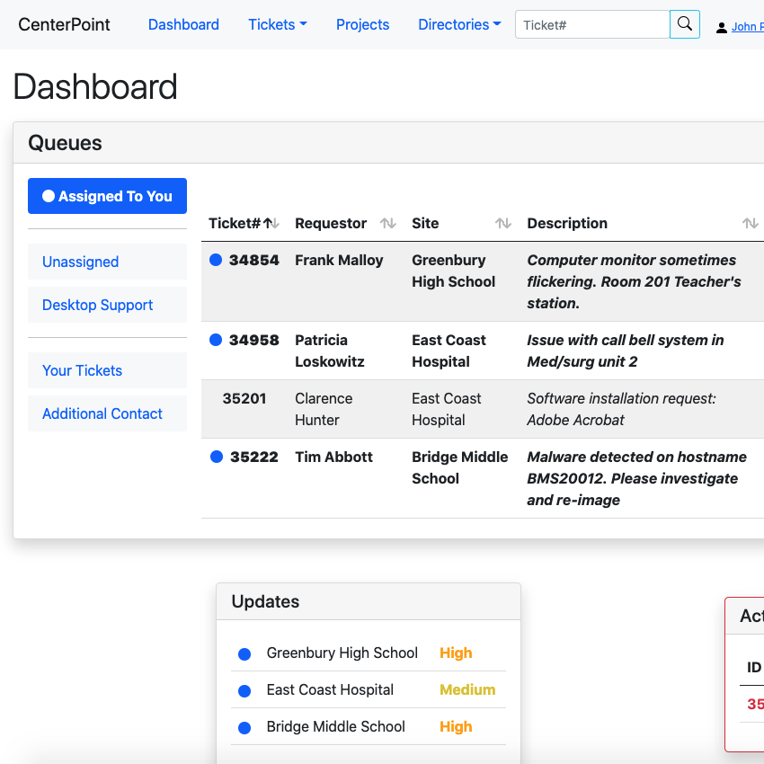
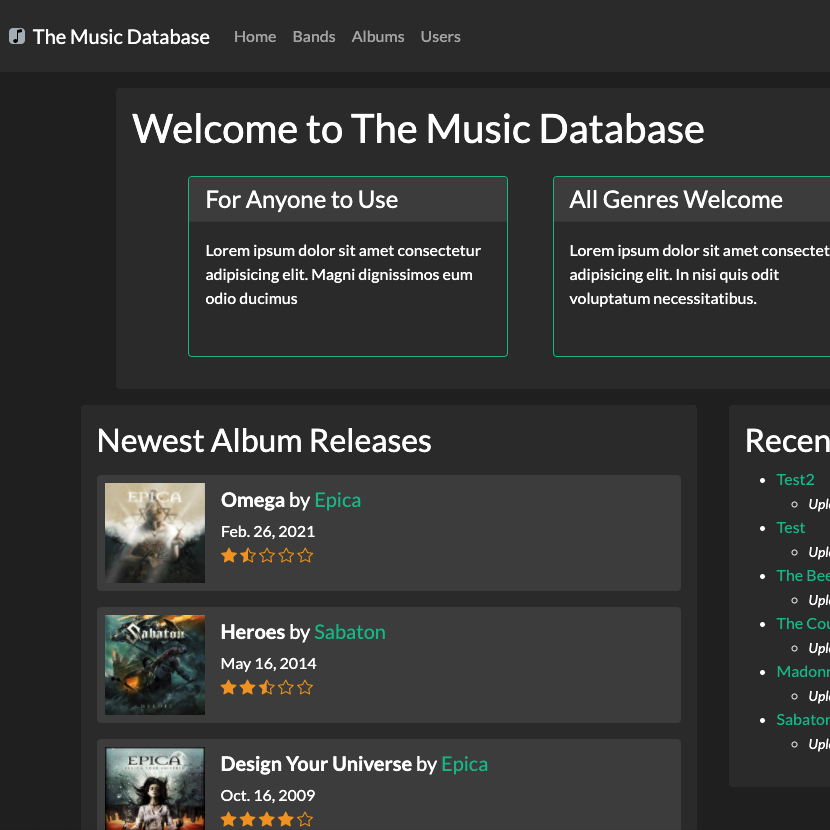

<!-- https://github.com/abhisheknaiidu/awesome-github-profile-readme

https://github.com/CurryFriedRice/

https://github.com/Ileriayo/markdown-badges -->
<link href="./src/style.css" rel="stylesheet">

<!-- <h1>PIXEL ART HERE</h1> -->

<h1>Tech Skills</h1>

    
    
    
    
    
    
    
    
    
    
    
    
    

 

<h1>Software Projects</h1>

<table><tbody>
    <tr>
        <td class="first-cell">
            <h2>CenterPoint 📒 | <a href="http://www.alasdairwallacemackie.com/centerpoint/">LIVE SITE</a></h2>
            
        </td>
        <td>
            <i>A browser-based IT trouble ticket tracking application for small businesses.</i>

<ul>
    <li>Designed application with distinct functionalities and features to optimize business process support for multiple end-user roles including technicians and managers.</li>
    <li>Developed a modern and responsive mobile-friendly web application with Bootstrap that enables end-users to easily navigate on their smartphones and tablets.</li>
    <li>Built an automated test suite with Python unittest to maintain clean and efficient code, and expedite feature updates.</li>
    <li>Deployed demo branch to portfolio website through Amazon Web Services, allowing interested business owners to test the application themselves at their own convenience.</li>
    <li>Provided CI/CD pipeline via Docker and GitHub Actions for stable development of multiple feature branches. </li>
</ul>
</td>
</tr>
</tbody></table>

<table><tbody>
    <tr>
        <td class="first-cell">
            <h2>Mars Rover App 🔴🌌 | <a href="https://github.com/AlasdairWallaceMackie/mars-rover-photos">GITHUB</a></h2>
            
        </td>
        <td>
            <i>An interactive web app utilizing NASA’s API for viewing info on past and present Mars rovers and the photographs they’ve taken.</i>

<ul>
    <li>Designed a single-page React application implementing React Router for lightning fast loading times and a smooth user experience.</li>
    <li>Integrated API data with a customizable interface allowing users to filter search results.</li>
</ul>
</td>
</tr>
</tbody></table>

<table><tbody>
    <tr>
        <td class="first-cell">
            <h2>The Music Database 🎵 | <a href="https://github.com/AlasdairWallaceMackie/music-database">GITHUB</a></h2>
            
        </td>
        <td>
            <i>A user-aggregated database application for cataloging musical artists and associated releases.</i>

<ul>
    <li>Developed custom interactive components using JavaScript for an intuitive and engaging user experience.</li>
    <li>Designed a responsive and mobile-friendly layout using Bootstrap for ease of use on smartphones.</li>
</ul>
</td>
</tr>
</tbody></table>

